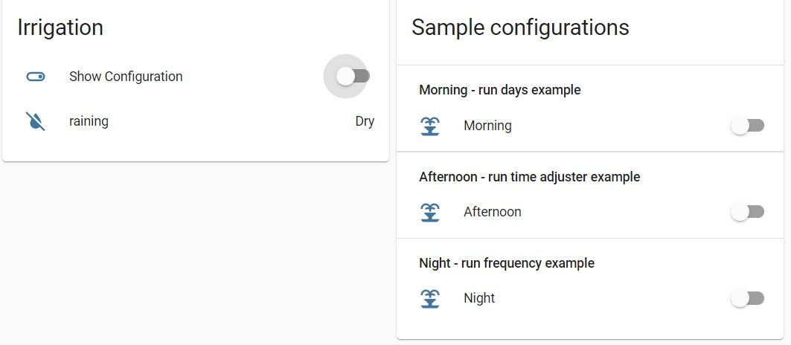
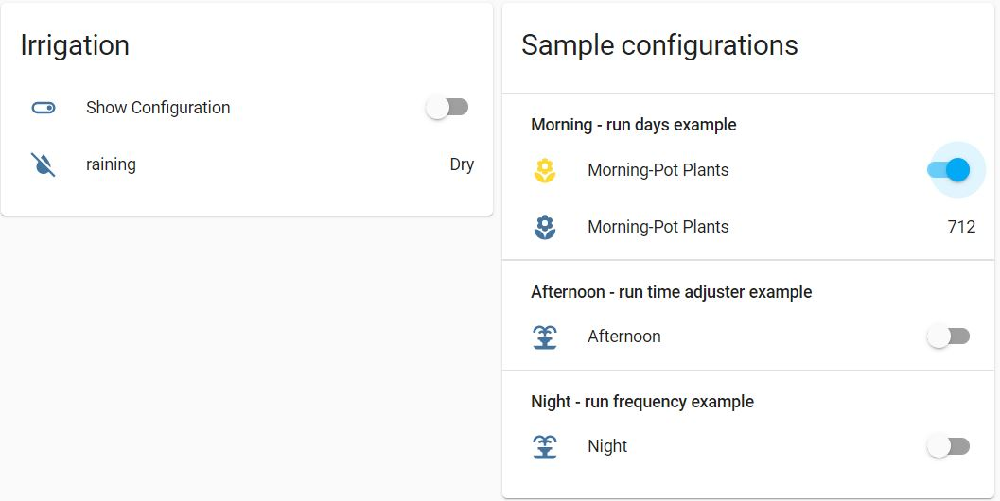

# Irrigation Component V3
The driver for this project is to provide an easy to configure user interface for the gardener of the house. The goal is that once the inital configuration is done all the features can be modified through lovelace cards. To further simplify things there are conditions in the Lovelace example to hide the configuration items.

 
Image 1: With Show configuration enabled

Image 2: With Show configuration disabled

Image 3: While a program is running

All the inputs of the new platforms are Home Assistant entities for example the start time is provided via a input_datetime entity. The information is evaluated to trigger the irrigation action according to the inputs provided.

Watering can occur in an Eco mode where a water/wait/repeat cycle is run to minimise run off by letting water soak as a by using several short watering cycles. The wait and repeat configuration is optional if you only want to water for a single lengthy period of time.

The rain sensor is implemented as a binary_sensor, this allows a practically any combination of sensors to suspend the irrigation. 

Additionally being implemented as a switch you can start a program manually or using an automation.

Only one program or zone can run at a time to prevent multiple solenoids being activated. If program start times result in an overlap the running program will be stopped.

Manually starting a program by turning the switch on will not evaluate the rain sensor, as there is an assumption that there is an intent to run the program.

## INSTALLATION

### To create a working sample
* Copy the irrigationprogram folder to the ‘config/custom components/’ directory 
* Copy the 'irrigation.yaml' file to the packages directory or into configuration.yaml. Sample configuration
* Copy the 'dummy_switches.yaml' file to the packages directory of into configuration yaml. This will provide dummy implementation of switches to represent solenoids.
* Restart Home Assistant
* In Lovelace create a 'manual' card and copy the contents of the 'lovelace.yaml' file

### Important
* Make sure that all of the objects you reference i.e. input_boolean, switch etc are defined or you will get errors when the irrigationprogram is triggered. Check the log for errors.

### Pre-requisite
* The time_date integration is required
```yaml
sensor:
  - platform: time_date
    display_options:
      - 'time'
      - 'date'
```

### Debug
Add the following to your logger section configuration.yaml
```yaml
logger:
    default: warning
    logs:
        custom_components.irrigationprogram: debug
```

### Rain Sensor feature
If a rain sensor is not defined the zone will always run.

If the irrigation program is run manually the rain sensor value is ignored and all zones will run.

The rain sensor is defined in each zone. You can:
* Define the same sensor for each zone 
* Have a different sensor for different areas
* Configure the ability to ignore the rain sensor

### Watering Adjuster feature
As an alternative to the rain sensor you can also use the watering adjustment. With this feature the integrator is responsible to provide the value using a input_number component.

Setting *water_adjustment* attribute allows a factor to be applied to the watering time.

* If the factor is 0 no watering will occur
* If the factor is 0.5 watering will run for only half the configured watering time.

### ECO feature
The ECO feature allows multiple small watering cycles to be used to minimise run off and wastage. Setting the optional configuration of the Wait, Repeat attributes of a zone will enable the feature. 

* *wait* sets the length of time to wait between watering cycles
* *repeat* defines the number of watering cycles to run

## CONFIGURATION

### Example configuration.yaml entry
```yaml
  switch:
  - platform: irrigationprogram
    switches: 
      morning:
        friendly_name: Morning
        irrigation_on: input_boolean.irrigation_on
        start_time: input_datetime.irrigation_morning_start_time
        run_freq: input_select.irrigation_freq
        icon: mdi:fountain
        zones:
        # Adjust watering time used 
        # Watering time adjusted to water * adjust_watering_time
          - zone: switch.irrigation_solenoid_01
            friendly_name: Pot Plants
            water: input_number.irrigation_pot_plants_run
            water_adjustment: input_number.adjust_run_time
            wait: input_number.irrigation_pot_plants_wait
            repeat: input_number.irrigation_pot_plants_repeat
            icon_off: 'mdi:flower'
        # No rain sensor defined, will always water to the schedule
          - zone: switch.irrigation_solenoid_03
            friendly_name: Greenhouse
            water: input_number.irrigation_greenhouse_run
            wait: input_number.irrigation_greenhouse_wait
            repeat: input_number.irrigation_greenhouse_repeat
            icon_off: 'mdi:flower'
        # Rain sensor used, watering time only
          - zone: switch.irrigation_solenoid_02
            friendly_name: Front Lawn
            water: input_number.irrigation_lawn_run
            rain_sensor: binary_sensor.irrigation_rain_sensor
            ignore_rain_sensor: switch.ignore_rain_sensor

    # minimal configuration, will run everyday at the time specified
      afternoon:
        friendly_name: Afternoon
        start_time: input_datetime.irrigation_afternoon_start_time
        zones:
          - zone: switch.irrigation_solenoid_01
            friendly_name: Pot Plants
            water: input_number.irrigation_pot_plants_run
          - zone: switch.irrigation_solenoid_02
            friendly_name: Front Lawn
            water: input_number.irrigation_lawn_run
```
## CONFIGURATION VARIABLES

## program
*(string)(Required)* the switch entity.
>#### friendly_name
*(string)(Required)* display name for the irrigation program switch.
>#### start_time
*(input_datetime)(Required)* the local time for the program to start.
>#### run_freq (mutually exclusive with run_days)
*(input_select)(optional)* A numeric value that represent the frequency to water, 1 is daily, 2 is every second day and so on. If not provided will run every day.
>#### run_days (mutually exclusive run_freq)
*(input_select)(Optional) * The selected option should provide a list days to run, 'Sun','Thu' will run on Sunday and Thursday. If not provided will run every day.
>#### irrigation_on
*(input_boolean)(Optional)* Attribute to temporarily disable the watering schedule
>#### icon
*(icon)(Optional)* The icon displayed for the program. (default: mdi:fountain)
>#### unique_id
*(string)(Optional)* An ID that uniquely identifies this switch. Set this to an unique value to allow customisation trough the UI.
>#### Zones 
*(list)(Required)* The list of zones to water.
>>#### zone
*(entity)(Required)* This is the switch that represents the solenoid to be triggered.
>>#### friendly_name
*(string)(Required)* This is the name displayed when the zone is active.
>>#### rain_sensor
*(binary_sensor)(Optional)* A binary sensor - True or On will prevent the irrigation starting. e.g. rain sensor, greenhouse moisture sensor or template sensor that checks the weather
>>#### ignore_rain_sensor
*(input_boolean)(Optional)* Attribute to allow the zone to run regardless of the state of the rain sensor. Useful for a greenhouse zone that never gets rain.
>>#### water
*(input_number)(Required)* This it the period that the zone will turn the switch_entity on for.
>>#### adjust_watering_time
*(input_number)(Optional)* This is a factor to apply to the watering time that can be used as an alternative to using a rain sensor. The watering time will be multiplied by this factor to adjust the run time of the zone.
>>#### wait
*(input_number)(Optional)* This provides for an Eco capability implementing a cycle of water/wait/repeat to allow water to soak into the soil.
>>#### repeat
*(input_number)(Optional)* This is the number of cycles to run water/wait/repeat.
>>#### switch_entity
*(switch)(Required)* The switch to operate when the zone is triggered.
>>#### icon_on
*(icon)(Optional)* This will replace the default mdi:water icon shown when the zone is running.


## SERVICES
```yaml
irrigationprogram.stop_programs:
    description: Stop any running program.
```
## ESPHOME

An example ESPHOME configuration file is included in the repository this example utilises:
* ESP8266 
* PCF8575 - I2C IO expander for up to 16 solenoids
* BME280 - temperature, pressure and humidity sensor
* Moisture Sensor - analogue/digital moisture sensor

## REVISION HISTORY

### 3.0.0
* BREAKING CHANGE: re-factor to deprecate the irrigationzone component
* Move zone details into the irrigationprogram component - feature request
* Move rain sensor to the zone definition - feature request 
* Move ignore rain sensor into the zone definition - feature request
* Improve validation of components to warn when HA objects are not found
* Add run time adjustment - feature request
* improved async behavior when automatically starting the program

### 1.1.0 
* add version to manifest.json files
* tweak how the program turns off zones
* remove validation for time.sensor

### 0.2
•            Remove requirement for HA time sensor
